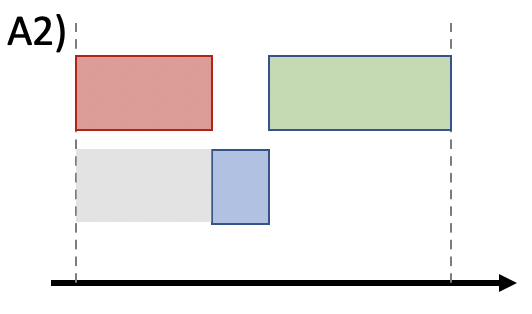
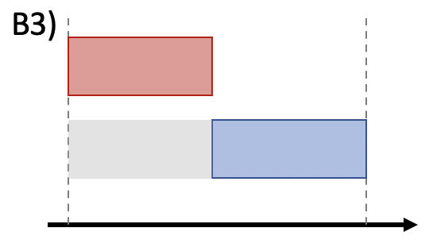

# How *SPOCK* works

## 1/ How `spock.long_term_scheduler` works

The SPECULOOS target list was contructed as described in [Sebastian et al. 2020](http://arxiv.org/abs/2011.02069) and include 1657 photometrically classified late-type dwarfs. These targets are divided in three distinct programs:
* Program 1: 365 dwarfs that are small and nearby enough to make possible the detailed atmospheric characterisation of an "Earth-like" planet with the upcoming JWST
* Program 2: 171 dwarfs of M5-type and later for which a significant detection of a planet similar to TRAPPIST-1b should be within reach of TESS
* Program 3: 1121 dwarfs later than M6-type that aims to perform a statistical census of short-period planets around ultracool dwarf stars.

The final product delivered by *SPOCK* are be daily scripts (ACP plans) for the SSO, SNO and SAINT-EX observatories. Before producing such files, *SPOCK* identifies which targets are the most interesting to observe at a given time, for how long and with which telescope while respecting the strategy agreed for each observation program. To do so, *SPOCK* relies on several criteria:

* The planet detectability of a target. For program 1 targets, this is quantified with $SNR_{JWST}$ which essentially is the estimated SNR in transmission spectroscopy that we would theoretically obtain from 200hr of observation with JWST/NIRSPEC of an "Earth-like" planet orbiting a given target. For program 2 targets we rather use the TESS detection SNR for a temperate planet, while for program 3 targets, the selection criterion is the SPECULOOS detection SNR for a temperate planet.

* The target's observability $obs_{cov}$ which indicates the most appropriate time to observe a given target. To do so, *SPOCK* computes the best visibility window of the year for each target. Every time a schedule is made, *SPOCK* selects new targets that are at their optimum visibility at this time of the year. The selected targets are then ranked and the one with the highest priority is scheduled (providing it respects constraints imposed by the facility like moon distance and minimum elevation). If observable all night, the target is simply scheduled all night, but if some gaps remain an additional target is added to complement the schedule and avoid losing observing time. Furthermore, to prevent having too short observation blocks (1 h or less) the duration of the two targets are set to be comparable. For instance, if one night is ~ 8 h long and target~1 is observable for the first 7 h only, target 2 is not going to be scheduled for the last hour only but rather the night will be split in half such that target 1 and 2 are observed for approximately the same amount of time. We say approximately because we do not exactly split the night in half, instead we adapt nightly the duration to each target's visibility (which shifts from night to night as the target visibility shifts from sunrise to sunset). This situation of observing two targets per night rather than one can happen frequently since many targets have latitudes that do not allow to fill up all the night time available for a given site, and this even at their peak visibility. To implement those constraints, *SPOCK* makes use of the *astroplan* package [Morris et al. 2018](http://arxiv.org/abs/1712.09631), a flexible python toolbox for astronomical observation planning and scheduling. *SPOCK* also optimises on the period of the year for which the target is the most visible at a relatively low airmass.
* The target's completion ratio, $r_{comp}=\frac{hours_{observed}}{hours_{threshold}}$, which embodies the fraction of hours of observation completed versus the number of hours required for each target. Note that the value of $hours_{threshold}$ depends on the program to which the target belongs, 200 hr for Program 1 and 100 hr for Program~2 and 3. Using this completion ratio to rank targets is useful to favour the quick completion of on-going targets rather than starting new ones continually.
* The program to which the target belongs, $p$. This criteria is useful if the user wants to favour a program more than the others. For instance, our current strategy is to complete observations of program 1 targets, such that $p=1$ for program 1 targets,  $p=0$ for program 3 targets, $p=0.3$ for TESS targets (program 2) to have back up targets in case no program 1 targets are observable.
* The coordination potential of observations with multiple sites. Indeed, as SPECULOOS uses a multi-site telescope network, one of the main roles of *SPOCK* is to handle the coordination of multi-site observations. For instance, between two targets with similar priority but one observable only from one site and the other from several sites, *SPOCK* will choose the target that yields the best coverage. Besides, when possible, 1 hour overlap between observations from two different sites is scheduled to help the recombination of the light curves.

*SPOCK* ranks all targets by multiplying these four criteria to compute the target's priority, which is simply defined as:

$priority = (SNR_{JWST})^{a} * (obs_{cov})^{b} * (r_{comp})^{c} * p + coordination$,

where $a, b, c$ are specific orders that we apply to each criteria based on their importance (higher order for planet detectability than completion ratio for instance) such that $a>b>c$. We note that coordination is the only additive criterion as coordination of observations between observatories has no incidence on our ability to observe a target nor on its interest for exoplanet search, such that a target with lack of coordination potential should not be discarded.

Once the priority of each target for a given day is computed, *SPOCK* picks the one with the highest score as the first target. Then, a function checks the observability window of the target, that is to say if it is observable all night, from sun set to mid-night, from mid-night to sun rise or from after sun set to before sun rise. In the latter scenario the target is discarded and the first target becomes the one with the second highest priority score (and so on) in order to avoid having short observations sequences of a second and third targets before and after the rise and set times of the first target. Then, another *SPOCK* function checks that the selected first target respects the moon distance and elevation constraint, and if not, this target is discarded and *SPOCK* picks the next target in descending order of priority as the first target. For all telescopes the moon distance constraint is set to a minimum of $30^{\circ}$ and the elevation constraint is set to a minimum of $25^{\circ}$ for SSO, SNO, TS/TN but a minimum of $28^{\circ}$ for Saint-Ex (decided by the consortium). We note that AstelOS also has an intrinsic elevation lower limit of $21^{\circ}$. Finally, if the selected target fulfils all these conditions it is scheduled and if not observable all night a second target is picked via the same selection process. As I mentioned in the description of the observability criterion, we avoid to observe more than two SPECULOOS targets per night to maximise on-target time and phase coverage. The exposure time for each target is computed using the SPECULOOS exposure time calculator (ETC) which is integrated in *SPOCK* in the form of a python class. The SPECULOOS ETC allows to compute the exposure time that will enable to reach a certain level of flux in a certain filter on a target, given its spectral type and magnitude (in either J or V), given the technical characteristics of the SPECULOOS telescopes (mirror size, focal ratio and coating) and cameras (quantum efficiency, temperature, gain, pixel scale, dark current, binning, read out noise) and given a set of conditions (seeing, airmass, moon phase, observatory altitude).

## 2/ How `spock.short_term_scheduler` works

Besides the three core programs detailed above, SPECULOOS dedicates 20\% of its observing time to external programs (and even up to 50\% in the special case of SAINT-EX with CHEOPS follow-up). For this reason, I developed another mode on *SPOCK* that allows to schedule the observation of external targets either for a defined period of time, with a given ephemeris or as long as physically possible. In that regard, *SPOCK* distinguishes four distinct cases of external programs: 

* Monitoring of a target for a given duration and in specific conditions (fixed airmass for instance). 

* Observation of a target as long as possible given the site constraints (moon distance, elevation, twilight limits). 

* Observation of a target given specific start/ end times for the observations. If the input times do not respect the intrinsic constraints of the observatory a warning is triggered and the start/end times are automatically adapted. 

* Follow-up observation of an up-coming transit or occultation event given a set of ephemeris. 

The aim of the `short_term_scheduler` is to modify existing plan by inserting a new block (corresponding to a *special* or *follow-up* target). Almost every night 1 ou 2 targets are observed per telescope. In that regards, the existing  night_block   can be either situation A or situation B, see below:

### Situation A

If we consider we are in situation A, four different modifications can happend when the new block is inserted. 

* First, the new block can be scheduled in between the existing blocks, in this case the `end_time` of the first target and `start_time` of the second target are modified.

* Second, the new block can be scheduled on the first target's slot (from sun set), in this case only the `start_time` of the first target is modified.

* Third, the new block can be scheduled on the second target's slot (up to sun rise), in this case only the `end_time` of the second target is modified.

* Second, the new block is scheduled in the middle of an existing block, in this case the target is splited in two distinct blocks:
    * The first one (named target as the original block) with `start_time = old_start_time` and `end_time = start_time_new_block` 
    * The second one (named target_2) `start_time = end_time_new_block` and `end_time = old_end_time` 

### Situation B

If we consider we are in situation B, three different modifications can happend when the new block is inserted. 

* First, the new block can be scheduled in the second part of the night (up to sun rise), in this case only the `end_time` is modified.

* Second, the new block is scheduled in the middle of the night, in this case the target is splited in two distinct blocks:
    * The first one (named target as the original block)  with `start_time = old_start_time` and `end_time = start_time_new_block` 
    * The second one (named target_2) `start_time = end_time_new_block` and `end_time = old_end_time` 

* Third, the new block is scheduled in the first part of the night (from sun set), in this case only the `start_time` is modified.

<strong>Note:</strong>  If you wish to update the number of hours observe on the TRAPPIST telescopes as well you need to have acces to the **Hours_observation_TS_TN** spread sheet. For this contact Elsa Ducrot (elsa.ducrot@cea.fr)
    

